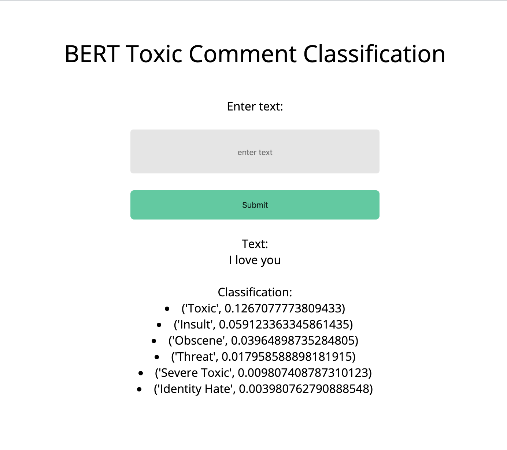

# BERT for Sequence Classification

Try the demo at [toxic.oliverproud.com](https://toxic.oliverproud.com)

# What is DistilBERT?

Thanks to the brilliant people at [Hugging Face 🤗](https://huggingface.co/) we now have DistilBERT, which stands for Distilated-BERT. DistilBERT is a small, fast, cheap and light Transformer model based on Bert architecture. It has 40% less parameters than `bert-base-uncased`, runs 60% faster while preserving 97% of BERT's performance as measured on the GLUE language understanding benchmark. DistilBERT is trained using knowledge distillation, a technique to compress a large model called the teacher into a smaller model called the student. By distillating Bert, we obtain a smaller Transformer model that bears a lot of similarities with the original BERT model while being lighter, smaller and faster to run. DistilBERT is thus an interesting option to put large-scaled trained Transformer model into production. [Transformers - Hugging Face repository](https://github.com/huggingface/transformers)

Victor Sahn of Hugging Face [wrote a great Medium post](https://medium.com/huggingface/distilbert-8cf3380435b5) introducing DistilBERT and explaining parts of their newly released [NeurIPS 2019 Workshop paper](

# Installation

If you are testing this on your own machine I would recommend you do the setup in a virtual environment, as not to affect the rest of your files. 

In Python3 you can set up a virtual environment with 

```bash
python3 -m venv /path/to/new/virtual/environment
```

Or by installing virtualenv with pip by doing 
```bash
pip3 install virtualenv
```
Then creating the environment with 
```bash
virtualenv venv
```
and finally activating it with
```bash
source venv/bin/activate
```

You must have Python3

Install the requirements with:
```bash
pip3 install -r requirements.txt
```

### Toxic Comment Fine-tuned model 

Note: I chose to fine-tune two models - BERT base and DistilBERT base. This is due to BERT base being too large to deploy, however you have to choice to use whichever model you would like in `model.py`

The toxic comment fine-tuned model is available in my S3 Bucket: 

- [DistilBERT model](https://toxic-model.s3.eu-west-2.amazonaws.com/distil_toxic_model.pt)

- [BERT model](https://toxic-model.s3.eu-west-2.amazonaws.com/toxic_model.pt)

 or alternatively you can fine-tune the model yourself using one of the provided notebooks in the train folder.

You can load your fine-tuned model with:

```python
model = linear_model(bert_model, len(labels_list))
model.load_state_dict(torch.load(path_to_model, map_location=torch.device('cpu')))
```

# Making predictions

You can test the model using the `predict` function in `model.py` or by using the provided Flask user interface or by heading to [toxic.oliverproud.com](https://toxic.oliverproud.com)



# How to train (Distil)BERT

Check out my notebooks on how to fine-tune BERT [here](https://github.com/oliverproud/bert-sequence-classification/tree/master/train_notebooks)

# References 

- <https://github.com/huggingface/transformers>
- <https://medium.com/huggingface/distilbert-8cf3380435b5>
